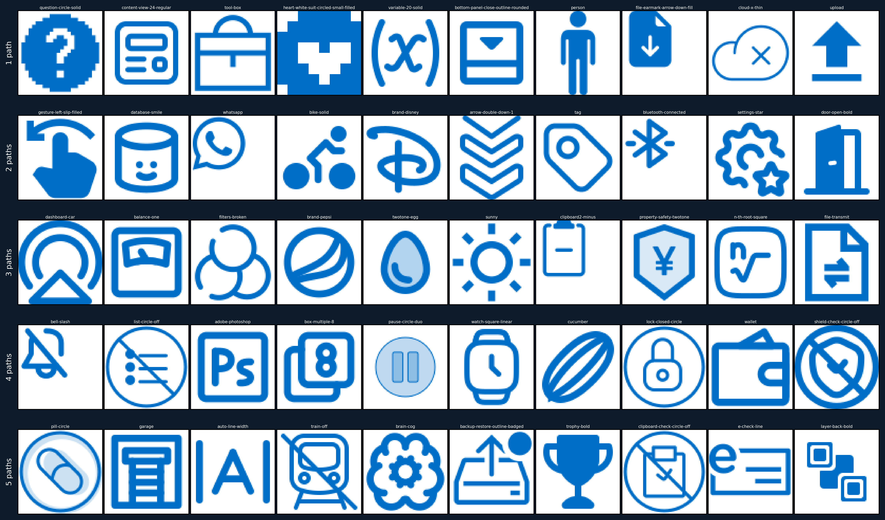
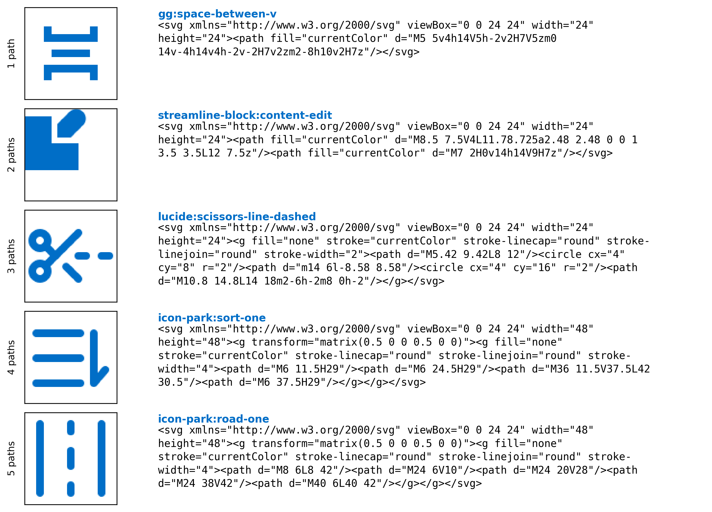
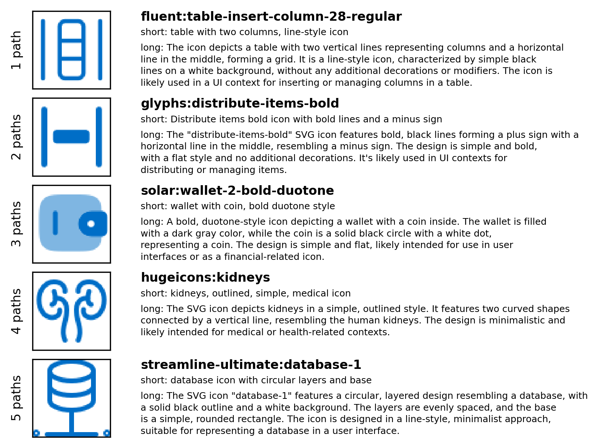
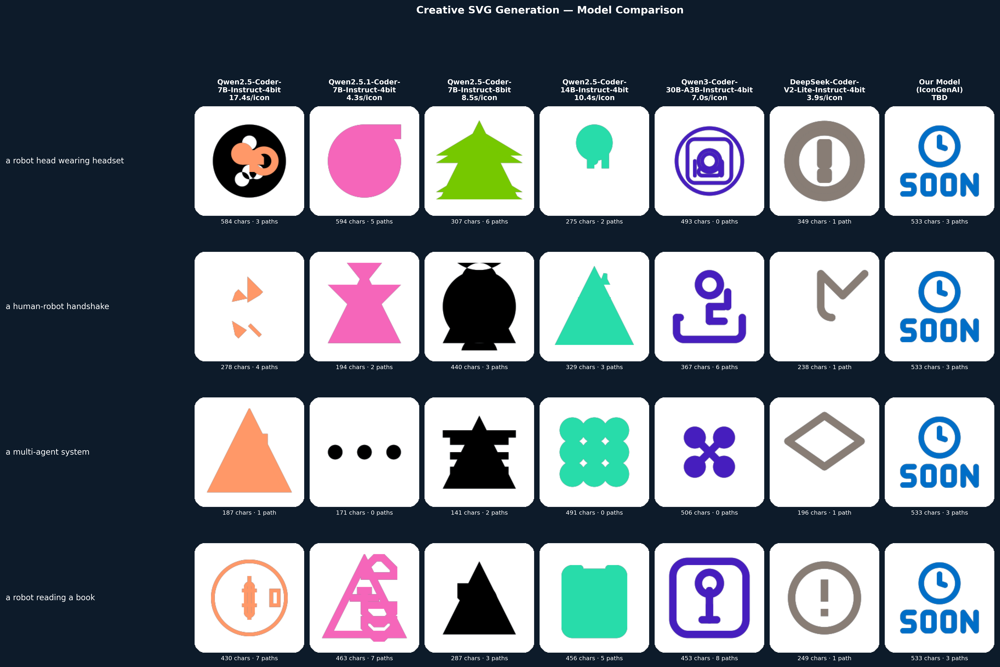

# IconGenAI

[](LICENSE)
[](https://creativecommons.org/licenses/by-nc/4.0/)
[](https://creativecommons.org/licenses/by-nc/4.0/)


Fine-tuning a code language model for high-quality **monochrome** text-to-SVG icon generation via QLoRA on the Iconify corpus. Generates pixel-perfect, instantly rebrandable icons using `currentColor`.


## Prerequisites

- macOS with Apple Silicon (training uses MLX)
- [uv](https://docs.astral.sh/uv/) — Python package manager (`brew install uv`)
- Cairo for SVG rendering (`brew install cairo`)
- ~20 GB free disk space (models + data)
- MacTeX for building the paper (`brew install --cask mactex`)

## Setup

```bash
git clone https://github.com/yauheniya-adesso/icongenai.git
cd icongenai
uv sync                   # core dependencies
uv sync --extra dev       # Jupyter, pandas, matplotlib, etc.
```

## Full Pipeline

### Step 0 — Download models

```bash
uv run scripts/00_download_models.py
```

Lists available MLX models on HuggingFace and downloads the ones needed for captioning and training.

### Step 1 — Collect icons

```bash
git clone https://github.com/iconify/icon-sets.git
# ~1.15 GB; all icons as JSON under icon-sets/json/

uv run scripts/01_collect.py
# → data/icons_filtered.jsonl  (275,912 icons after license filtering)
```

<p align="center">
  
  <br>
  <em>Fig. 1: Sample icons stratified by structural complexity (1–5 `path` elements).</em>
</p>


The final training sample retains only static, monochrome icons (single-color icons are converted to `currentColor`; logo, brand, flag, and emoji collections are excluded), with at most 5 `path` elements and SVG string length below the 99th percentile — yielding ~214k icons. Each SVG is normalized before training: XML boilerplate and metadata tags are stripped, floating-point coordinates are rounded to 2 decimal places, whitespace is collapsed to a single space, and the `viewBox` is rescaled to `0 0 24 24` via an SVG `matrix()` transform.

<p align="center">
  
  <br>
  <em>Fig. 2: Sample normalized SVG code stratified by structural complexity (1–5 `path` elements).</em>
</p>

### Step 2 — Caption dataset

```bash
caffeinate -i uv run scripts/02_caption.py
# → data/icons_captioned.jsonl
```

Uses Qwen2.5-VL-7B to generate short + long natural language descriptions for each icon. Resumes automatically if interrupted — safe to restart.

<p align="center">
  
  <br>
  <em>Fig. 3: Sample icons and their automatically generated captions, stratified by structural complexity (1–5 `path` elements).</em>
</p>


See [Parallel captioning](#parallel-captioning) below to split this across two machines.

### Step 3 — Prepare splits

```bash
uv run scripts/03_prepare.py
# → data/{train,valid,test}.jsonl  (90/5/5 split, ChatML format)
```

Applies curriculum ordering (simple → complex by path count) and augmentation (up to 3 variants per icon) by default.

### Step 4 — Train LoRA adapter

```bash
bash scripts/04_train.sh
# → models/icongenai-lora/
# → logs/train_<timestamp>.log
```

Quick feasibility check (~10 min on M4):

```bash
bash scripts/04_train.sh --iters 500 --model mlx-community/Qwen3-1.7B-4bit
```

Production default is `mlx-community/Qwen3.5-9B-MLX-4bit`, 10 000 iters.

### Step 5 — Generate

```bash
uv run scripts/05_generate.py --adapter models/icongenai-lora
# → results/generated.jsonl

# Zero-shot baseline (no adapter):
uv run scripts/05_generate.py --no-adapter

# Quick sanity check on first 200 prompts:
uv run scripts/05_generate.py --adapter models/icongenai-lora --n 200
```

<p align="center">
  
  <br>
  <em>Fig. 4: Qualitative comparison of code language models on monochrome SVG icon generation. Our model (IconGenAI) column is a placeholder pending fine-tuning.</em>
</p>

### Step 6 — Evaluate

```bash
# Fast (no PyTorch required):
uv run scripts/06_evaluate.py --skip-clip --skip-fid

# Full metrics (requires PyTorch):
uv run scripts/06_evaluate.py
# → results/generated.metrics.json
```

Metrics: validity rate, render success rate, mean path count, CLIP score, FID.

---

## Parallel captioning

The captioning step (Step 2) takes the longest. Split the 275,912 icons across two machines by index range — `02_caption.py` supports `--offset` and `--limit` for exactly this.

**Machine 1** (already in progress, resume from ~20k and stop before machine 2's range):

```bash
caffeinate -i uv run scripts/02_caption.py --limit 225912
```

**Machine 2** (last 50k icons):

```bash
# 1. Copy the source data to machine 2
#    Do NOT re-run 01_collect.py on machine 2 — the Iconify repo may have changed,
#    producing a different file with a different line order, which would break the split.
rsync -avz --progress data/icons_filtered.jsonl user@machine2:~/icongenai/data/

# 2. On machine 2 — caption only the last 50k
caffeinate -i uv run scripts/02_caption.py --offset 225912
# → data/icons_captioned.jsonl on machine 2
```

**Merge on machine 1** once both are done:

```bash
# Pull machine 2's output
rsync -avz user@machine2:~/icongenai/data/icons_captioned.jsonl \
    data/icons_captioned_machine2.jsonl

# Merge and deduplicate by icon_id
python3 - <<'EOF'
import json, pathlib

parts = ["data/icons_captioned.jsonl", "data/icons_captioned_machine2.jsonl"]
seen = {}
for path in parts:
    for line in pathlib.Path(path).read_text().splitlines():
        if line.strip():
            rec = json.loads(line)
            seen[rec["icon_id"]] = rec

out = pathlib.Path("data/icons_captioned_merged.jsonl")
out.write_text("\n".join(json.dumps(r) for r in seen.values()) + "\n")
print(f"Merged: {len(seen):,} icons → {out}")
EOF
```

Then pass the merged file to Step 3:

```bash
uv run scripts/03_prepare.py --input data/icons_captioned_merged.jsonl
```


